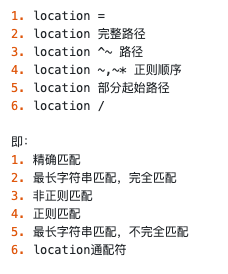

# Nginx

## 介绍

NGINX（Engine X）是一款轻巧，高性能的HTTP和反向代理服务器，也可作为通用代理服务器（TCP/UDP/IMAP/POP3/SMTP），最初由俄罗斯`Игорь Сысоев`撰写。

NGINX是高性能的HTTP和反向代理服务器，其特征是存储器使用率低和强大的并发能力。实际上，NGINX的并发功能优于相同类型的Web服务器

NGINX专门为性能优化而开发。最重要的要求是性能，它非常关注效率。据报道，NGINX最多可以支持50000个并发连接


## Forward proxy and reverse proxy

NGINX是反向代理服务器，那么什么是反向代理？让我们首先看一下所谓的前锋代理

正向代理：LAN中的计算机用户直接访问网络是不可行的，并且只能通过代理服务器（服务器）访问。这项代理服务称为forward代理。

反向代理：客户端无法感知代理，因为客户端无需配置网络即可访问网络，只要请求发送到反向代理服务器，反向代理服务器就会选择目标服务器来获取数据，然后返回给客户端。反向代理服务器和目标服务器只是外部世界的服务器，它们公开了代理服务器地址并隐藏了真实的服务器IP地址

## Load balancing 负载均衡

`负载均衡`：高可用网络基础架构的关键组成部分，通常用于在多个服务器上分发工作负载，以提高网站，应用程序，数据库或其他服务的性能和可靠性。

如果没有负载均衡，则客户端和服务器之间的操作通常是：客户端请求服务器，然后服务器转到数据库查询数据并将返回的数据带到客户端


但是，随着客户数量的增加以及数据和流量的快速增长，这种情况并不令人满意。从上图我们可以看到，客户端的请求和响应都通过服务器，如果我们增加服务器的数量，以此通过共享多个服务器能解决此问题么？

目前，对于客户而言，他可以访问此地址，因此他不会关心服务器的时间。您只需要将数据返回给我，就可以了，因此我们需要一个“Manager”，找到这些服务器的老板，客户直接找到老板，然后老板分配了处理谁的数据，从而减少了数据服务器上的压力，此“ BOSS”是反向代理服务器，端口号是这些服务器的员工


当有120个请求时，反向代理服务器将均匀分布到服务器，也就是说，每个服务器将处理40个请求。此过程称为：`负载均衡`。当然，有很多方法可以实施分配，我只是简要介绍了其中一个

## Dynamic and static separation 动静分离

客户启动请求时，正常情况是： 


静态资源：如HTML、CSS

动态资源：如Golang

为了减少服务器上的压力，我们将动态资源和静态资源分开，然后将它们交给不同的服务器进行解析，从而加快解析并减少单个服务器上的压力。


## 安装Nginx

要安装NGINX，您可以参考在线教程

在这里，我列出了一些常用命令:

- View version: nginx -v
- Start: nginx
- Shutdown: nginx -s stop
- Determine whether the configuration file is correct: nginx -t
- Reload configuration: nginx -s reload


## NGINX configuration file

配置文件分为三个模块:

Global 全局部分：从配置文件的开头到 Events 部分，主要是设置某些影响NGINX服务器整体操作的配置指令。（可以合理地说，在配置并发处理服务时，值越大，可以支持并发处理越多，但是此时它将受到硬件，软件和其他设备的限制）。

Events 部分：影响NGINX服务器和用户之间的网络连接。常见设置包括是否启用多个工作过程中的网络连接序列化，是否允许同时接收多个网络连接，等等。

HTTP 部分：此处配置了反向代理和负载均衡

## Location 匹配规则

有以下四种方式配置：
```bash
location[ = | ~ | ~* | ^~ ] url {
    
}
```


其中，方括号中的四种标识符是可选项，用来改变请求字符串和uri的匹配方式。uri是待匹配的请求字符串，可以是不包含正则的字符串，这种模式被称为“标准的uri”；也可以包含正则，这种模式被称为”正则uri”，如下：

```bash
location ~ .*\.(php|php5)?$ {

}

```

### 四种可选的标识符

|标识符|描述|
|--------|----|
|`=`|`精确匹配`，用于标准的URL，需要严格匹配URL，并且只有在完全相等的情况下，才能停止向下搜索和请求过程|
|`^~`| `非正则匹配` 即在没有正则表达式的情况下用于URL之前，需要NGINX服务器来查找URL和字符串之间最高匹配度的位置，然后使用此位置立即处理请求而无需正则匹配|
|`~`| `正则匹配` 最佳匹配，用于表明URL包含正则表达式, 对大小写敏感|
|`~*`| `正则匹配` 与 ~ 相同，但不区分大小写|


备注：

1. 如果uri里面包含正则表达式，就必须使用~或~*标识符；
2. 针对~和~*匹配标识符，可以在前面加上!来取反，如下：
- !~ 表示正则不匹配，区分大小写。
- !~* 表示正则不匹配，不区分大小写。

### 案例

“=”精准匹配案例

```bash
location  = /login {
  # 精确匹配 /login ，匹配成功后，立即结束
}
```

“~”区分大小写正则匹配案例
```bash
location ~ /images/ {
  #正则匹配，区分大小写，匹配成功后，立即结束
}
```

“~*”不区分大小写正则匹配案例
```bash
location ~* /images/ {
  #正则匹配，不区分大小写，匹配成功后，立即结束
}
```

“^~” 不进行正则匹配的标准匹配
```bash
location ^~ /images/ {
  # 匹配任何以 /images/ 开头的地址，匹配符合以后，停止往下搜索正则，采用这一条。
}
```
普通匹配（最长字符匹配）
```bash
location  /blog/ {
  # 与location顺序无关
  # 若完全匹配成功，就不在继续匹配，否则还会进行正则匹配
}
```


location匹配顺序

在没有标识符的请求下，匹配规则如下：

- nginx服务器首先在server块的多个location块中搜索是否有标准的uri和请求字符串匹配。如果有多个标准uri可以匹配，就匹配其中匹配度最高的一个location。
- 然后，nginx在使用location块中，正则uri和请求字符串，进行匹配。如果正则匹配成功，则结束匹配，并使用这个location处理请求；如果正则匹配失败，则使用标准uri中，匹配度最高的location。

备注：

- 如果有精确匹配，会先进行精确匹配，匹配成功，立刻返回结果。
- 普通匹配与顺序无关，因为按照匹配的长短来取匹配结果。
- 正则匹配与顺序有关，因为是从上往下匹配。(首先匹配，就结束解析过程)。
- 在location中，有一种通配的location，所有的请求，都可以匹配，如下

```bash
location  / {
  # 因为所有的地址都以 / 开头，所以这条规则将匹配到所有请求
  # 但是正则和最长字符串会优先匹配
}
```

结合标识符，匹配顺序如下：




### Example

```bash
location = / {  
   //精确匹配/ ，主机名后面不能带任何字符串
    echo "规则A";
}
 
location = /login {
  //精确匹配 /login 开头的地址，匹配符合以后，不在继续往下搜索 
    echo "规则B";
}
 
location ^~ /blog/ { 
  //非正则匹配，匹配/blog/后，停止往下搜索正则，采用这一条
  echo "规则C";
}
 
location ~  \.(gif|jpg|png|js|css)$ {
    //区分大小写的正则匹配  若匹配成功，停止往下搜索正则，采用这一条
    echo "规则D";
}
 
location ~* \.png$ {  
   //区分大小写的正则匹配 ，停止往下搜索正则，采用这一条
    echo "规则E";
}
 
location / {
  //因为所有的地址都以 / 开头，所以这条规则将匹配到所有请求
  //如果没任何规则匹配上，就采用这条规则
    echo "规则F";
}
 
location /blog/detail { 
  //最长字符串匹配，若完全匹配成功，就不在继续匹配，否则还会进行正则匹配
  echo "规则G";
}
 
location /images {  
    //最长字符串匹配，同上 
    echo "规则Y";
}
 
location ^~ /static/files {  
    //非正则匹配，若匹配成功，就不在继续匹配
    echo "规则X";
}
```

1. 当访问根路径/的时候，比如http://www.xxx.com.cn/ ，会匹配规则A。
2. http://www.xxx.com.cn/login被访问时 ，会匹配规则B。
3. http://www.xxx.com.cn/login.html被访问时 ，会匹配规则F。
4. http://www.xxx.com.cn/blog/detail/3.html被访问时 ，会匹配规则C。分析思路，首先看看，“精确匹配”是否可以匹配成功，显示不可以；然后，看看是否可以“普通匹配”是否可以完全匹配，显示也没有；接着在看看非正则匹配，是否可以匹配成功，发现同规则C匹配上了，所以采用了规则C。


