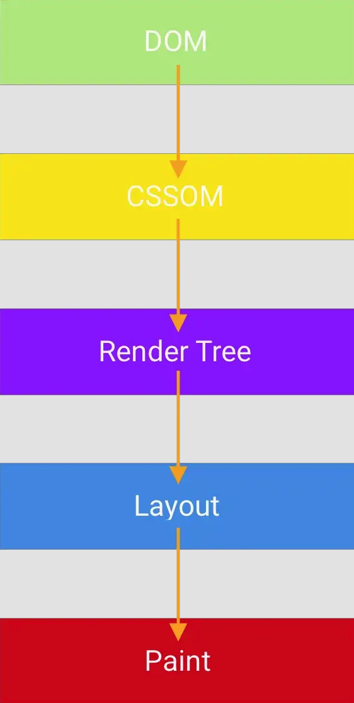
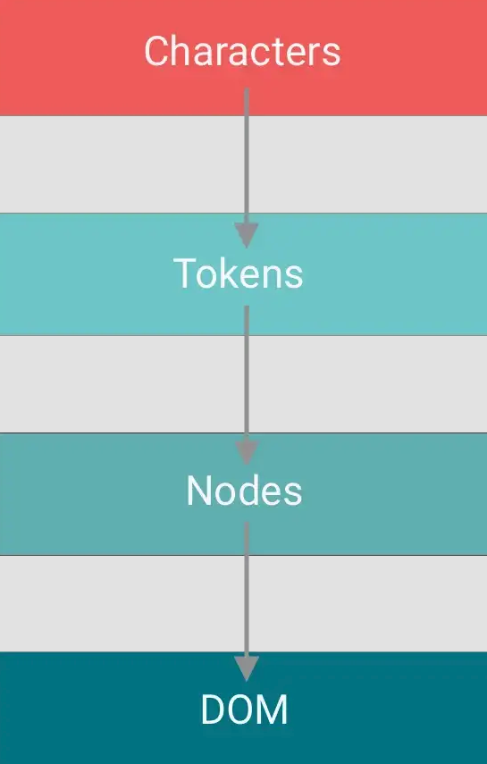
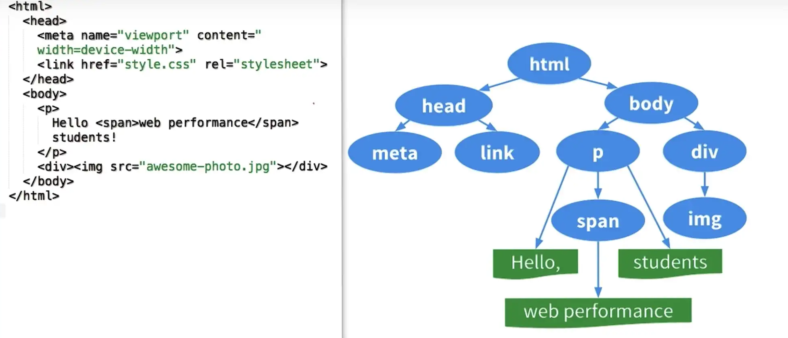
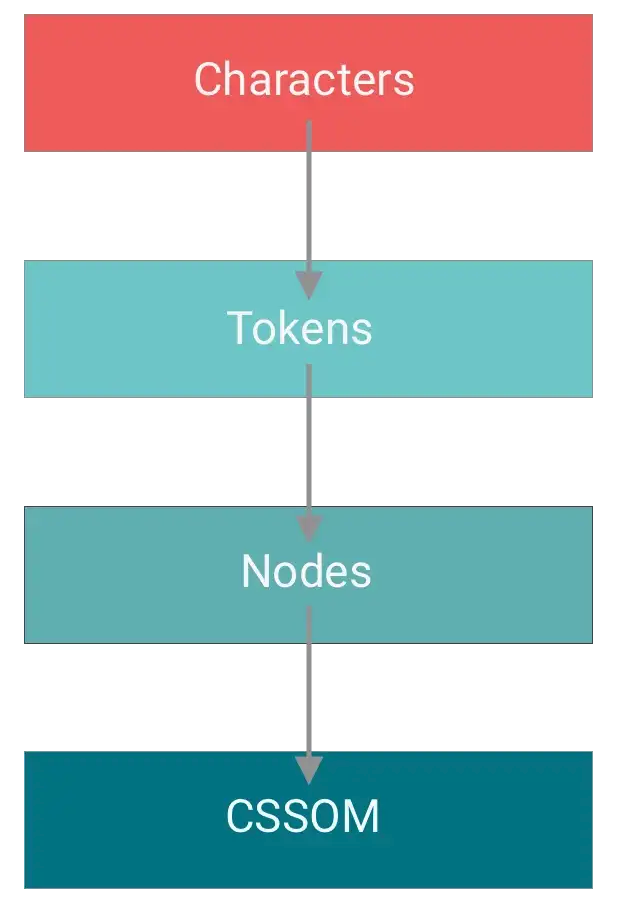
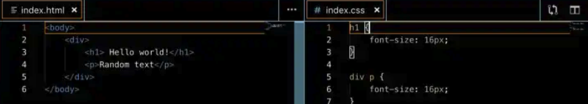
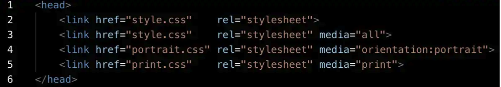
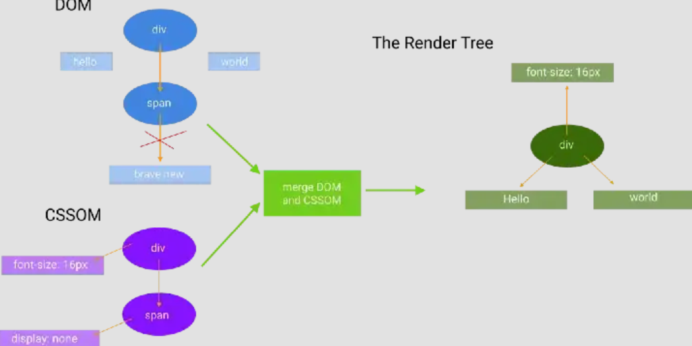
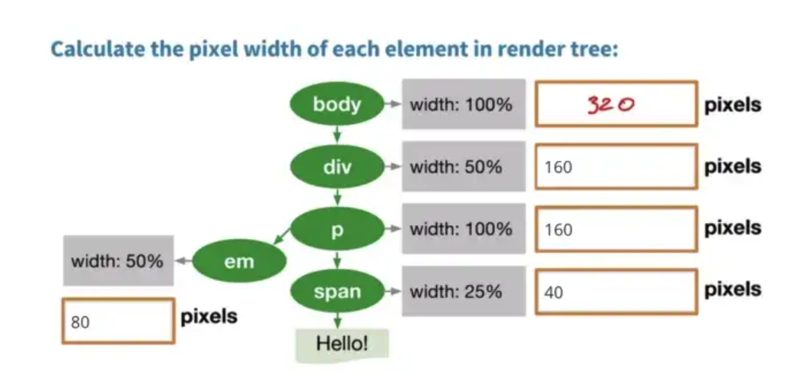

# Critical Render Path

Critical Render Path(下文缩写为CRP)是浏览器通过将HTML，CSS和JavaScript转换为屏幕上实际像素的步骤的顺序。一旦我们了解了关键的渲染路径，我们将能够改善网站的加载时间。 在开始前，我们做下几个关键点的拆分：

- 资源加载
- 浏览器渲染
- 浏览器渲染的流程


## CRP队列

在我们开始深入解答之前，我们先简单了解一下CRP的整体流程



1. DOM: 浏览器通过字符、标签和创建DOM节点来处理HTML，最终将成为DOM的一部分
2. CSSOM: 一旦进入Head的解析，浏览器就可以获取所需的CSS资源并开始构建CSSOM。（正如我们将在下文看到的那样，这部分会导致阻塞）
3. Building the Render Tree: 将创建的DOM和CSSOM结合起来创建渲染树
4. Layout: 通过检查创建的渲染树来计算页面的布局
5. Paint: 最终完成页面渲染

## DOM 构建

1. 浏览器以字节格式接收HTML。
2. 扫描字符来识别标签。
3. 一旦确定标签，浏览器过程就会开始处理标签并创建DOM节点。
4. 节点之间的关系由start（<>）和end（</>）标签定义。

整体的DOM 构建流程如下:


一旦浏览器消费了所有标签并创建它们的节点，我们就会得到DOM树结构。有关如何将HTML转换为DOM的示例，请参见下面的图像：


DOM树的构建过程会阻塞渲染，因为没有DOM，浏览器将渲染空白。

## CSSOM 构建

DOM捕获页面的内容，但浏览器还需要知道如何显示页面本身——CSSOM为此而生。解析和构建CSSOM的过程与DOM的过程非常相似



通过上图流程，浏览器对CSS进行了解析，并将其映射到了浏览器DOM节点上。


### CSS 映射

映射算法简单朴素。浏览器使用相应的标识符搜索节点。当从右到左阅读规则时，更具体的CSS规则需要更长的时间才能找到和应用。让我们下图示例 - 您认为哪个规则需要更长的时间才能应用 ？



```
第一个规则说修改任何<h1>标签的字体大小为16px。

第二个规则（从右到左阅读）说找到<p>标签。对于每个<p>标签搜索<div>祖先。如果存在，则应用字体大小16px。显然，当我们在树上添加更多的DOM节点时，该规则更为复杂，并且需要更长的时间才能找到。话虽如此，但差异和渲染影响可能是微不足道的。

令人惊讶的是，构建CSSOM在浏览器上也会阻塞渲染。这是因为在应用CSS之前，许多网站基本上都无法使用。
```

尽管CSS会阻塞渲染，但`media`使我们能够将某些CSS资源标记为非渲染阻止。特意声明的媒体类型可以真正提高加载时间（节省了不必要的获取和解析！）

请看以下示例：



- 前两个CSS链接是等效的，不论浏览器尺寸、加载如何，它们都将正常应用。
- 仅当将屏幕的方向设置为`portrait`时，第三个CSS才能适用。
- 仅当我们打印文档时，第四个CSS才能适用。
- 其中最后两种媒体类型使这些资源可以无障碍加载

“渲染阻塞”仅指浏览器是否必须暂停页面的渲染，直到收到该资源为止。而需要注意的是，无论什么情况，浏览器将始终下载所有CSS资源，不受阻塞或非阻塞行为影响。


## 构建渲染树 Render Tree

渲染树结合了DOM和CSSOM，仅包含屏幕上可见的内容。因此，我们不会在渲染树中看到显示设置为无的元素



渲染树完成后，我们可以继续进行布局阶段

## 布局 Layout

我们有渲染树，但我们仍然需要弄清楚应该如何将元素放在屏幕上。为了找出页面上每个对象的确切大小和位置，浏览器将以接收到的渲染树的根节点开始进行渲染。

除非特殊设置，否则节点元素放置始终相对于父级。让我们来看看：



布局阶段的时间取决于几个因素：
- 运行的设备
- 文档的大小
- 应用的样式

文档的越大，样式越复杂，完成布局阶段所需的时间就越长


# 总结

通过上文，总结一下我们学到的：

- 通过HTTP从浏览器获取请求收到的网页所需的步骤
- 解析和过程HTML并构建DOM
- 解析和处理CSS并构建CSSOM
- 合并渲染树的DOM和CSSOM
- 运行布局计算以计算渲染树中每个节点的大小和位置
- 在屏幕上绘制每个节点（像素）

而为了使我们的页面加载更快，我们需要尽可能快地进入上述过程中的每个步骤。


