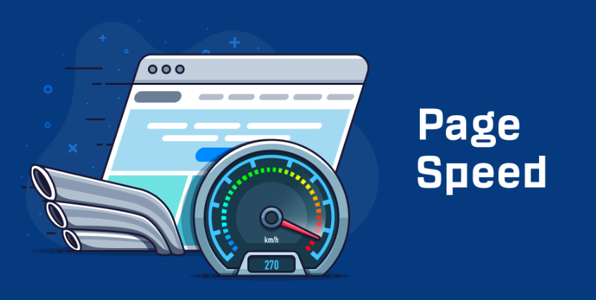
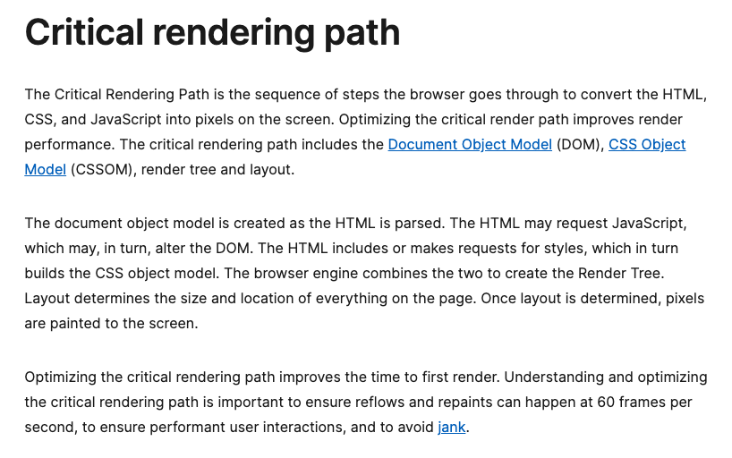
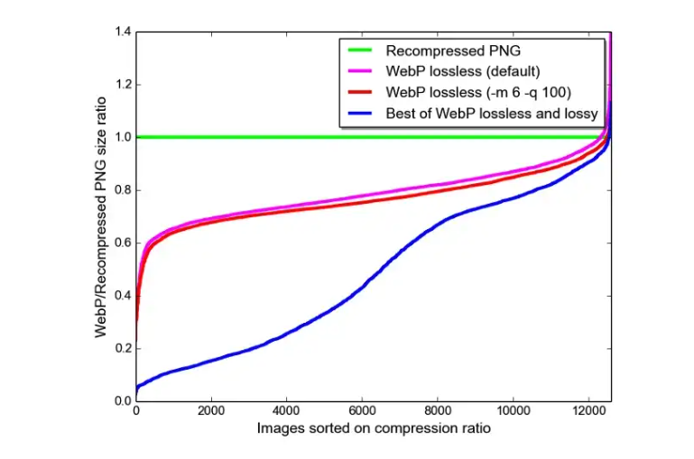
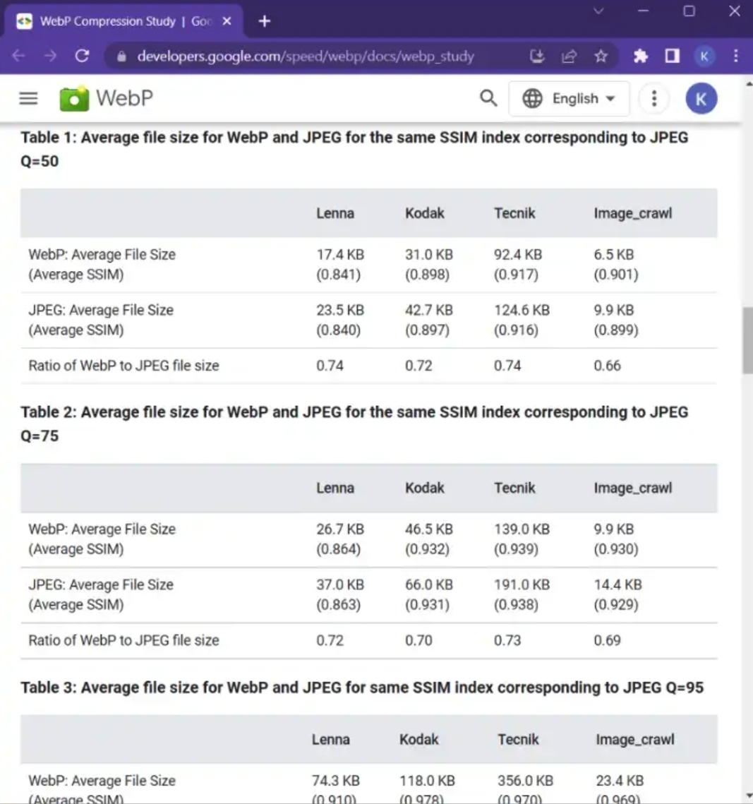

# 提升加载速度10倍+之HTML&CSS优化

# 前言

众所周知，Web用户都会对页面加载缓慢感到抵触😵‍💫


> 阅读 [web性能与转化率](https://mp.weixin.qq.com/s?__biz=MzI4NDA3NjY5NA==&mid=2247483749&idx=1&sn=7f76d39f5c5dbfc7211111979c592bd5&chksm=eb81be9cdcf6378a5b17e818c8da240c1e347bd8e09d9963c22adf1746e41ffa7c6b8c77de12&token=1947964996&lang=zh_CN#rd) 你会更深刻认识到缓慢的加载性能对web应用的影响



本文将介绍 `如何通过更改HTML和CSS特性来提高网站的页面负载速度`，而无需采用提供最佳的托管服务等困难的方式。


# Critical rendering path 关键渲染路径长度

我们来看下 [MDN中关于Critical rendering path的内容](https://developer.mozilla.org/en-US/docs/Web/Performance/Critical_rendering_path) 以下简称（CRP）



我们来简单翻译一下：

CRP是浏览器通过将HTML，CSS和JavaScript转换为屏幕上像素的步骤的顺序。优化关键的渲染路径可改善渲染性能。关键渲染路径包括文档对象模型（DOM），CSS对象模型（CSSOM），渲染树和布局。

在解析HTML时，创建文档对象模型。HTML可能会请求JavaScript，该JavaScript可能会改变DOM。HTML包括或提出对样式的请求，进而构建CSS对象模型。浏览器引擎将两者结合在一起以创建渲染树。布局确定页面上所有内容的大小和位置。确定布局后，将像素涂在屏幕上。(渲染流程见下图crp-flow)

优化关键的渲染路径可以提高第一次渲染的时间。了解和优化关键的渲染路径对于确保以每秒60帧的速度进行`回流`和`重绘`至关重要，以确保执行用户的交互并避免JANK。

更详细的解析可以查看往期文章：
> [Web开发必须要知道的CRP](https://mp.weixin.qq.com/s?__biz=MzI4NDA3NjY5NA==&mid=2247483765&idx=1&sn=3158997b4cc230d472dd9df11c4ee1f9&chksm=eb81be8cdcf6379ac209548418a3e07051b5a2d3d88fd613bd0b56f16465501a25349d40ec3d&token=1947964996&lang=zh_CN#rd)


# 优化技巧

核心内容开始

## 1. Lazy Loading 懒加载

通过上文的关于`CRP`的了解，我们来看下`懒加载`—— 它是web开发工程师熟知的缩短`CRP`的策略 （`CRP`长度直接影响页面加载时间）


### a. Split CSS file 

CSS尽可能轻量，做适当的分片，这样浏览器能更快地加载它们，并建议使用媒体类型media来避免渲染阻塞

```html
<!-- 直接这样引入会容易阻塞渲染 -->
<link rel="stylesheet" href="styles.css" />
```

🖥 Print 使用
```html
<!-- 不会造成渲染阻塞 -->
<link rel="stylesheet" href="print.css" media="print" />
```

📱 Mobile端使用
```html
<!-- 加载和解析不会阻塞大屏（长屏）的渲染 -->
<link
  rel="stylesheet"
  href="mobile.css"
  media="screen and (max-width: 480px)" />
```

👨🏻‍💻 平板使用
```html
<!-- 加载和解析不会阻塞大屏（长屏）的渲染 -->
<link
  rel="stylesheet"
  href="tablet.css"
  media="screen and (max-width: 1080px)" />
```

📲 移动端不同方向的使用
```html
<link href="portrait.css" rel="stylesheet" media="(orientation:portrait)" />
```

通过对CSS进行文件分片、压缩，能有效避免渲染阻塞，提升页面加载速度。

### b. 字体font-display

应用 `@font-face规则`——它定义了字体文件是如何由浏览器加载和显示的字体文件，允许文本在加载出现时或失败时用`fallback`字体展示。这可以通过使文本可见而不是渲染白屏来提高性能。

```css
@font-face {
  font-family: "nunito", sans-serif;
  font-weight: 400;
  font-style: normal;
  font-display: fallback;
}
```

### c. 图片

让用户可以在第一秒钟看到（需要查看）顶部的图像。使用 `loading=“lazy”`，以便按需加载图像，提升页面加载速度。

```html

```

## 2. 正确的图片加载方式

### .webp格式

以`.webp格式`制作图像。建议将其作为Web的图像格式标准。

与PNG相比，`.webp格式无损图像`的尺寸小26％。`.webp格式受损图像`在等效SSIM质量指数的情况下，仍然比JPEG图像小25–34％。`.webp格式动态图像`中都支持有损、无损和透明度，与GIF和APNG相比，该图像仍可以减小一定的“重量”。


**WebP vs PNG Image Format**



**WebP vs JPEG Image Format**




**通过所有这些数据，足以证明`.webp格式`能使页面加载速度提升很多**

> 我们还可以考虑使用图像格式.avif，在少数情况下比.webp更好，但它是市场的新事物（2019年发布），因此没有多少浏览器支持.avif格式


### 使用`<picture>`标签

a）用于针对不同媒体条件进行裁剪或修改图像（例如，在较小的显示器上加载具有太多细节的图像的简单版本）。

b）提供替代图像格式，对于不支持WebP格式的情况。

c）通过为查看器显示器加载最合适的图像来节省带宽和超速加载时间。

如果需要提供 更高密度版本的DPI（Retina）显示图像，请改用``上的`srcset`。这使浏览器可以选择避免数据模式的较低密度版本，而我们不必明文设置`media`属性

```html
<picture>
  <source srcset="my-logo-wide.webp" type="image/webp" media="(min-width: 600px)" />
  <source srcset="my-logo-wide.jpeg" type="image/jpeg" type="image/jpeg" media="(min-width: 600px)" />
  <source srcset="my-logo-narrow.webp" type="image/webp" /> 
  
</picture>
```

## 3. 图像渲染

由于图像是异步加载并在浏览器第一次渲染之后继续加载的，如果其尺寸在加载前未定义，则它们可能会导致页面内容的`重绘`（例如，当文本经过图像加载撑开页面时。）。

因此，至关重要的是，您必须设置宽度和高度属性，以便浏览器可以在布局中为其保留空间。

而对于 `background-image`，重要的是需要设置一个`background-color`，以便在下载图像之前仍可以读取页面内容。


## 4. 压缩混淆 Html 和 Css 文件

从代码中删除所有不必要的字符，以减少大小。，例如空格、换行、Tab、不需要的白空间字符等。并删除评论。

使用诸如CodeBeautify，CSS Minifier等的缩小工具来缩小您的HTML和CSS文件。这些将对提升页面加载速度有很大帮助


# 总结

以上更改肯定会为您的网站带来10倍+的加载速度， 快去试试吧～

