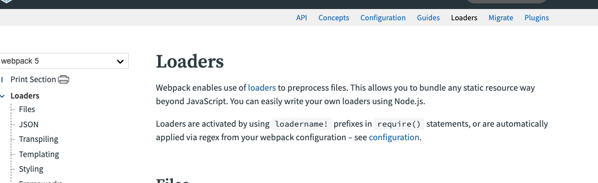
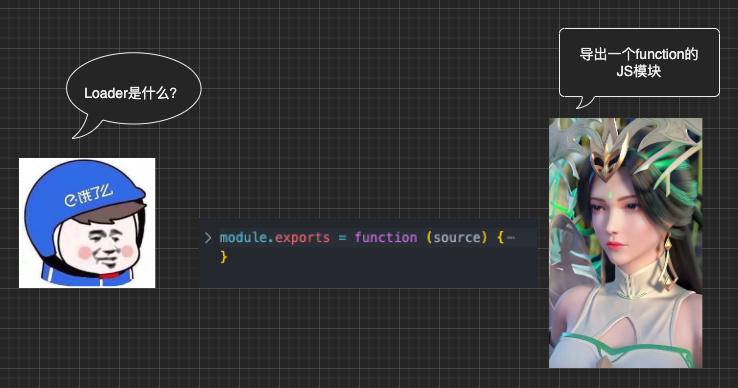
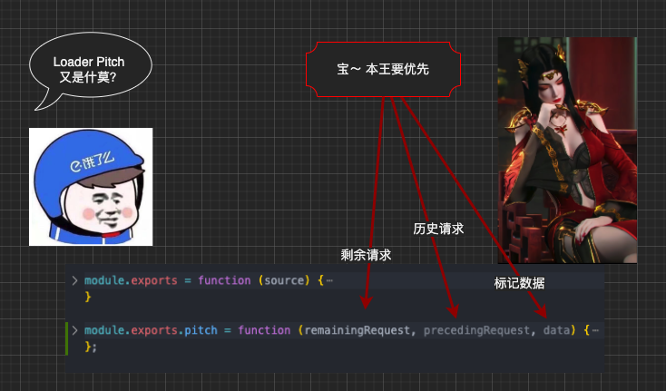
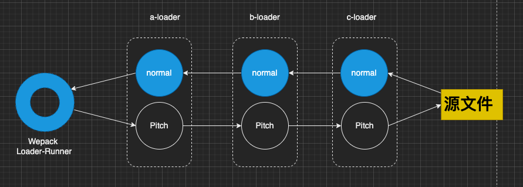
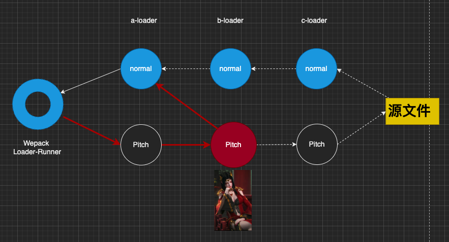

# Loader

Webpack —— 一个广泛应用于前端领域的模块化构建工具。利用webpack, 我们可以打包js、css、图片、字体等类型的`静态资源`。 而其中不得不说的就是Loader。

本文将带大家深入loader:

- Loader 是什么？
- Loader 如何加载？
- Loader 如何执行？

# Loader 是什么

 我们先看下官网的介绍




> 翻译：
   webpack 可以使用 Loader 来预处理文件。它允许对除js之外的其他静态类型资源进行构建。得益于node.js，我们可以更方便快速的编写属于自己的loader。

好像还不够直接？一图胜千言👇：



通过上图我们得知，Loader会导出一个`function`。这个function可用于内容的转换，我们暂称它为 `Normal Loader`。
我们来看下它的 [API支持](https://webpack.js.org/api/loaders/#root)：

```js
/**
 *
 * @param {string|Buffer} content 源文件内容
 * @param {object} [map] SourceMap 解析数据（解析工具👉🏻https://github.com/mozilla/source-map）
 * @param {any} [meta] Meta data, could be anything
 */
function webpackLoader(content, map, meta) {
  // code of your webpack loader
}

```

## 示例解读
 
 接下来，我们将会给出几个样例来加深大家对loader的理解

### Sync Loader
 同步loader， 使用return 或 this.callback 来直接返回转换过的内容：

```js

module.exports = function (content, map, meta) {
    // 直接返回处理后的内容
    return someSyncOperation(content);
    // 或使用this.callback, 可以传递多个参数给下一个loader
    this.callback(null, someSyncOperation(content), map, meta);
    return 
}
```

### Async Loader 
异步loader, 通过`this.async`来执行callback：
```js
module.exports = function (content, map, meta) {
  var callback = this.async();
  someAsyncOperation(content, function (err, result, sourceMaps, meta) {
    if (err) return callback(err);
    callback(null, result, sourceMaps, meta);
  });
};
```

### 推荐使用哪种loader

Loader 最初设计是在Node.js的同步管道（enhanced-require）中使用，但目前在webpack中也支持异步调用。而同步机制容易导致阻塞，因此，我们在开发自己的loader过程中 `尽量采用Async Loader 规范进行开发`


# Loader 如何被加载的

`Loader 的执行顺序始终是从右到左的` , 但 loader的`pitch`属性执行的顺序却是从左到右的，并且它们的执行是在所有Loader开始执行之前， 我们暂且称它为`Patch Loader`




## 示例

`此时Loader.pitch属性返回为undefined`

```js
// webpack configuration
// loader 可采用以上任意一例作为demo
module.exports = {
  //...
  module: {
    rules: [
      {
        //...
        use: ['a-loader', 'b-loader', 'c-loader'],
      },
    ],
  },
};
```

执行顺序为：


```bash
|- a-loader `pitch`
  |- b-loader `pitch`
    |- c-loader `pitch`
      |- requested module is picked up as a dependency
    |- c-loader normal execution
  |- b-loader normal execution
|- a-loader normal execution
```


## Loader.pitch

那 `pitch ` 又有什么特别的属性支持么？

首先，webpack 会优先传递“情报” data 给到 loader, loader 可以基于这个“情报”在loader从右到左执行前获取到需要的信息进行一些定制操作, return为非undefined生效：

```js
// 
module.exports.pitch = function (remainingRequest, precedingRequest, data) {
  if (data.value === 52 || someOtherCondition()) {
    return (
      'module.exports = require(' +
      JSON.stringify('-!' + remainingRequest) +
      ');'
    );
  }
};

```

当`pitch`返回不为 **`undefined`** 时，执行顺序如下：

```bash
|- a-loader `pitch`
  |- b-loader `pitch` returns a module
|- a-loader normal execution
```




# Loader 如何执行

通过上文，我们得知了Webpack Loader-Runner 运行 Normal Loader 和 Pitch Loader 的流程， 那它们又是如何执行的呢？ this.callback、 this.async 又是哪里来的呢？


## 源码解读


我们先看下 webpack中关于Loader的类型声明文件 LoaderContext.d.ts 【declarations/LoaderContext.d.ts】：

```ts

/** The properties are added by https://github.com/webpack/loader-runner */
export interface LoaderRunnerLoaderContext<OptionsType> {

	/**
	 * Make this loader async.
	 */
	async(): WebpackLoaderContextCallback;


	callback: WebpackLoaderContextCallback;
	/**
	 * The directory of the module. Can be used as context for resolving other stuff.
	 * eg '/workspaces/ts-loader/examples/vanilla/src'
	 */
	context: string;

	readonly currentRequest: string;

	readonly data: any;

	readonly previousRequest: string;

	readonly remainingRequest: string;

	readonly request: string;
	/**
	 * An array of all the loaders. It is writeable in the pitch phase.
	 * loaders = [{request: string, path: string, query: string, module: function}]
	 *
	 * In the example:
	 * [
	 *   { request: "/abc/loader1.js?xyz",
	 *     path: "/abc/loader1.js",
	 *     query: "?xyz",
	 *     module: [Function]
	 *   },
	 *   { request: "/abc/node_modules/loader2/index.js",
	 *     path: "/abc/node_modules/loader2/index.js",
	 *     query: "",
	 *     module: [Function]
	 *   }
	 * ]
	 */
	loaders: {
		request: string;
		path: string;
		query: string;
		fragment: string;
		options: object | string | undefined;
		ident: string;
		normal: Function | undefined;
		pitch: Function | undefined;
		raw: boolean | undefined;
		data: object | undefined;
		pitchExecuted: boolean;
		normalExecuted: boolean;
	}[];

}
```

看到了 context 是不是很熟悉？ webpack 加载loader 会指定上下文然后注入我们提到的 callback 、async 等属性

通过首行注释链接 我们来进一步看下 loader-runner 是如何来解析Normal Loader 和 Pitch Loader 的：


```js
// https://github.com/webpack/loader-runner/blob/dac81a7f171993e6a1aa15bfd86b115db197d75d/lib/LoaderRunner.js#L103
function runSyncOrAsync(fn, context, args, callback) {
	var isSync = true;
	var isDone = false;
	var isError = false; // internal error
	var reportedError = false;
    // this.async 属性注入 
	context.async = function async() {
		if(isDone) {
			if(reportedError) return; // ignore
			throw new Error("async(): The callback was already called.");
		}
		isSync = false;
		return innerCallback;
	};
    // this.callback 属性注入
	var innerCallback = context.callback = function() {
		if(isDone) {
			if(reportedError) return; // ignore
			throw new Error("callback(): The callback was already called.");
		}
		isDone = true;
		isSync = false;
		try {
			callback.apply(null, arguments);
		} catch(e) {
			isError = true;
			throw e;
		}
	};
    // 解析执行
	try {
		var result = (function LOADER_EXECUTION() {
			return fn.apply(context, args);
		}());
		if(isSync) {
			isDone = true;
			if(result === undefined)
				return callback();
			if(result && typeof result === "object" && typeof result.then === "function") {
				return result.then(function(r) {
					callback(null, r);
				}, callback);
			}
			return callback(null, result);
		}
	} catch(e) {
		if(isError) throw e;
		if(isDone) {
			// loader is already "done", so we cannot use the callback function
			// for better debugging we print the error on the console
			if(typeof e === "object" && e.stack) console.error(e.stack);
			else console.error(e);
			return;
		}
		isDone = true;
		reportedError = true;
		callback(e);
	}

}

```

通过源码，我们可以清晰地知道我们的Normal Loader 和 Pitch Loader `作为 fn 参数传入`，注入 `async`、`callback`属性， 最终采用 `fn.apply(context, args)`调用的全过程。


Loader解析结果又是如何处理的呢？ 我们继续查看源码：

```js
build(options, compilation, resolver, fs, callback) {
    // 省略部分代码
    return this._doBuild(options, compilation, resolver, fs, err => {
        // if we have an error mark module as failed and exit
        if (err) {
            this.markModuleAsErrored(err);
            this._initBuildHash(compilation);
            return callback();
        }
        // 省略部分代码
        let result;
        try {
            result = this.parser.parse(this._ast || this._source.source(), {
                current: this,
                module: this,
                compilation: compilation,
                options: options
            });
        } catch (e) {
            handleParseError(e);
            return;
        }
        handleParseResult(result);
    });
}


```

由以上代码可知，在 `this._doBuild` 方法的回调函数中，

会使用 基于`acorn`的`JavascriptParser 解析器`对返回的内容进行解析操作。

而解析后的结果，会交给 `handleParseResult` 函数进行进一步处理。

这里就不展开介绍了，感兴趣的bro可以自行阅读一下相关源码, respect 🌚 ~ 


# 总结

本文携手 `柳神`、`美杜莎`、`Ele么小哥` 介绍了 Normal Loader、Pitch Loader 及它们如何被加载、执行的内容，希望阅读完本文之后，Bro 们对 Webpack Loader 机制能有更深刻的理解。


