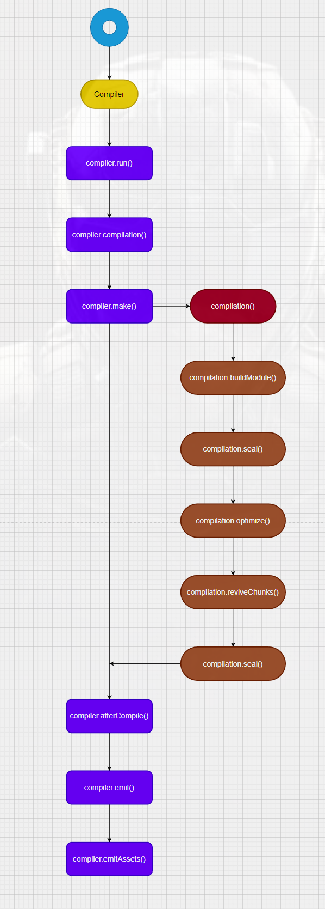
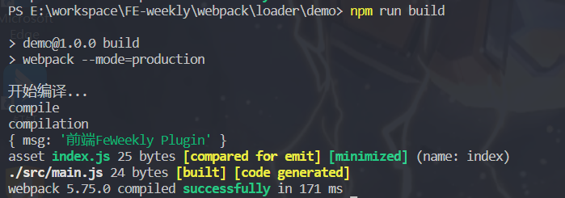

# Plugins

上一篇深入讲到了Webpack-Loader, 本文将继续介绍一下Plugins，你将了解到一下内容：

- 是什么
- 与Loader的区别
- 如何编写一个Plugin
- webpack 事件流机制
- Compiler与Compilation

# 定义

> Plugins are the backbone of webpack. Webpack itself is built on the same plugin system that you use in your webpack configuration! They also serve the purpose of doing anything else that a loader cannot do. Webpack provides many such plugins out of the box.

人肉翻译：
 
 Plugins是webpack的核心。webpack 本身也是建立在同一Plugin体系上即用户在webpack配置中使用的那部分。而创建Plugins的目的是处理Loader不能处理的事情。对此，Webpack 也提供了许多开箱即用的插件。

### 结合实际使用，我们做个更直白的解读：

 Plugin就像一个可实例化的对象（带有应用属性）， 它支持用户通过hook方式注入事件到整个webpack的生命周期之中。
 而webpack中几乎80%的部分都是由自身的插件体系构成 —— webpack是一个 `事件驱动` 的体系结构


# 与Loader的区别

我们回顾下上一篇中我们对Loader的解读，不难总结出它们之间的区别：

- loader 是一个转换器，将 A 文件进行编译成 B 文件，比如：将 A.less 转换为 A.css，单纯的文件转换过程。webpack 自身只支持 js 和 json 这两种格式的文件，对于其他文件需要通过 loader 将其转换为 commonJS 规范的文件后，webpack 才能解析到。

- plugin 是一个扩展器，它丰富了 webpack 本身，针对是 loader 结束后，webpack 打包的整个过程，它并不直接操作文件，而是基于`事件流机制`工作，会监听 webpack 打包过程中的某些节点，执行广泛的任务。


# 编写插件

在开始编写之前，我们需要先了解以下内容：

- 事件流机制 与 `Tapable`

- Compiler API 及 生命周期图解

## 事件流机制与Tapable

webpack 本质上是一种事件流的机制，它的工作流程就是将各个插件串联起来，而实现这一切的核心就是 `Tapable`。

Webpack 的 `Tapable` 事件流机制保证了插件的有序性，将各个插件串联起来， Webpack 在运行过程中会广播事件，插件只需要监听它所关心的事件，就能加入到这条 webapck 机制中，去改变 webapck 的运作，使得整个系统扩展性良好。

`Tapable` 也是一个小型的 library，是 Webpack 的一个核心工具。类似于 node 中的 events 库，核心原理就是一个订阅发布模式。作用是提供类似的插件接口。方法如下

```js
//  广播事件
compiler.apply('event-name', params)
compilation.apply('event-name', params)

// 监听事件
compiler.plugin('event-name', function (params) {})
compilation.plugin('event-name', function (params) {})

```

我们来看下 Tapable:
```js
function Tapable() {
  this._plugins = {}
}
//发布name消息
Tapable.prototype.applyPlugins = function applyPlugins(name) {
  if (!this._plugins[name]) return
  var args = Array.prototype.slice.call(arguments, 1)
  var plugins = this._plugins[name]
  for (var i = 0; i < plugins.length; i++) {
    plugins[i].apply(this, args)
  }
}
// fn订阅name消息
Tapable.prototype.plugin = function plugin(name, fn) {
  if (!this._plugins[name]) {
    this._plugins[name] = [fn]
  } else {
    this._plugins[name].push(fn)
  }
}
//给定一个插件数组，对其中的每一个插件调用插件自身的apply方法注册插件
Tapable.prototype.apply = function apply() {
  for (var i = 0; i < arguments.length; i++) {
    arguments[i].apply(this)
  }
}

```

Tapable 为 webpack 提供了统一的插件接口（钩子）类型定义，它是 webpack 的核心功能库。webpack 中目前有十种 hooks，在 Tapable 源码中可以看到，他们是:

```js
const {
	SyncHook,
	SyncBailHook,
	SyncWaterfallHook,
	SyncLoopHook,
	AsyncParallelHook,
	AsyncParallelBailHook,
	AsyncSeriesHook,
	AsyncSeriesBailHook,
	AsyncSeriesWaterfallHook
} = require("tapable");

```

Tapable 还统一暴露了三个方法给插件，用于注入不同类型的自定义构建行为：

- tap：可以注册同步钩子和异步钩子。
- tapAsync：回调方式注册异步钩子。
- tapPromise：Promise 方式注册异步钩子。

`webpack 里的几个非常重要的对象，Compiler, Compilation 和 JavascriptParser 都继承了 Tapable 类，它们身上挂着丰富的hook`


## Compiler

compiler 对象中保存着完整的 Webpack 环境配置，每次启动 webpack 构建时它都是一个独一无二，仅仅会创建一次的对象。

这个对象会在首次启动 Webpack 时创建，可以通过 compiler 对象上访问到 Webpack 的主环境配置，如 loader 、 plugin等配置信息。

### Compiler主要属性：

- compiler.options 可以访问本次启动 webpack 时候所有的配置文件，包括但不限于 loaders 、entry 、output 、plugin 等等完整配置信息

- compiler.inputFileSystem 和 compiler.outputFileSystem 可以进行文件操作，相当于 Nodejs 中 fs

- compiler.hooks 通过上文的介绍，我们得知compiler继承了Tapable类，它可以注册 [Tapable](https://github.com/webpack/tapable#tapable)  的不同种类 Hook，从而可以在 compiler 生命周期中植入不同的逻辑。（ 此处不展开， 详情的话可以查看官方文档 ）


### Compiler API调用生命周期

我们先来看下webpack创建Compiler对象及其API调用的流程：




### 插件编写

一个 webpack 插件由以下组成：

- 一个 JavaScript 命名函数。
- 在插件函数的 prototype 上定义一个 apply 方法。
- 指定一个绑定到 webpack 自身的事件钩子。
- 处理 webpack 内部实例的特定数据。
- 功能完成后调用 webpack 提供的回调。

最小demo实现：
```js
class FeWeeklyPlugin {
  constructor(options) {
    this.options = options
  }
  apply(compiler) {
    compiler.hooks.run.tap('run', () => {
      console.log('开始编译...')
    })

    compiler.hooks.compile.tap('compile', () => {
      console.log('compile')
    })

    compiler.hooks.done.tap('compilation', () => {
      console.log('compilation')
    })

    compiler.hooks.done.tap('FeWeeklyPlugin', () => {
      console.log(this.options)
    })
  }
}

module.exports = FeWeeklyPlugin
```

然后在 webpack 的配置中注册使用就行，只需要在 webpack.config.js 里引入并实例化就可以了：
```js
const path = require('path')
const FeWeeklyPlugin = require('./build/plugin-1')

module.exports = {
  entry: {
    index: path.join(__dirname, '/src/main.js'),
  },
  output: {
    path: path.join(__dirname, '/dist'),
    filename: 'index.js',
  },
  plugins: [new FeWeeklyPlugin({ msg: '前端FeWeekly Plugin' })],
}
```

我们来执行一下：




有一些编译插件中的步骤是异步的，这样就需要额外传入一个 callback 回调函数，并且在插件运行结束时执行这个回调函数

```js
class WebpackPlugin2 {
  constructor(options) {
    this.options = options
  }
  apply(compiler) {
    compiler.hooks.beforeCompile.tapAsync('compilation', (compilation, cb) => {
      setTimeout(() => {
        console.log('编译中...')
        cb()
      }, 1000)
    })
  }
}

module.exports = WebpackPlugin2
```

## Compilation 对象

[Compilation](https://www.webpackjs.com/api/compilation-hooks/) 对象代表了一次资源版本构建。

当运行 webpack 开发环境中间件时，每当检测到一个文件变化，就会创建一个新的 compilation，从而生成一组新的编译资源。

一个 Compilation 对象表现了当前的模块资源、编译生成资源、变化的文件、以及被跟踪依赖的状态信息。
即把本次打包编译的内容存到内存里。

Compilation 对象也提供了插件需要自定义功能的回调，以供插件做自定义处理时选择使用拓展。（简单来说，Compilation 的职责就是构建模块和 Chunk，并利用插件优化构建过程。）

Compiler 代表了整个 Webpack 从启动到关闭的生命周期，而 Compilation 只是代表了一次新的编译，只要文件有改动，compilation 就会被重新创建。


### Compiler 和 Compilation 的区别

- Compiler 代表了整个 Webpack 从启动到关闭的生命周期
- Compilation 只是代表了一次新的编译，只要文件有改动，compilation 就会被重新创建。


# 总结

通过本文对webpack-plugin的解读，希望小伙伴们对plugin有了更深的认识。如果觉得有用，点个赞吧👍

