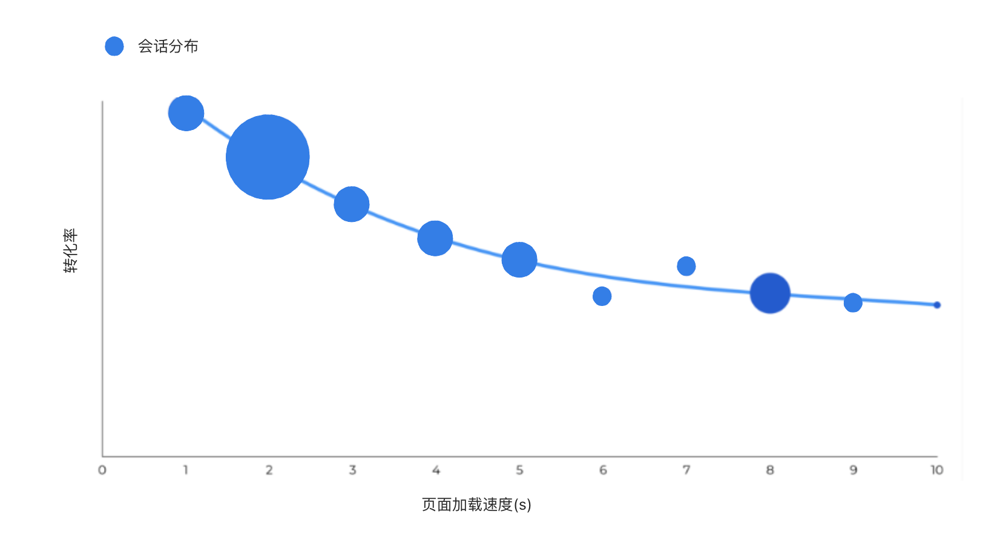
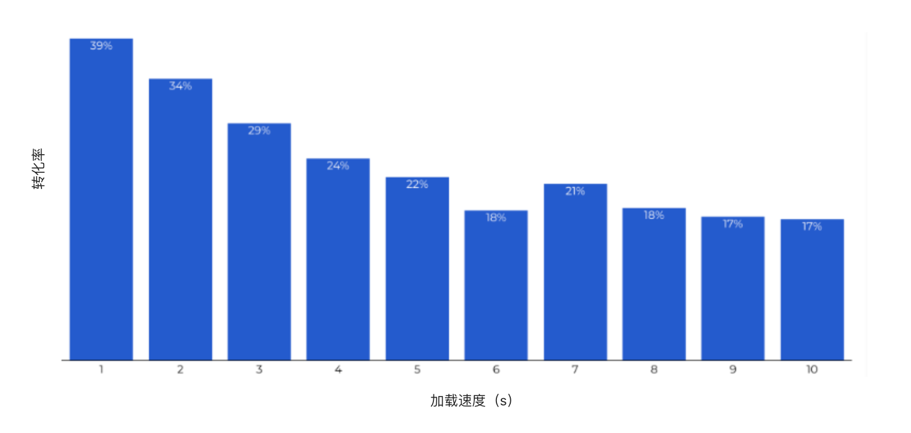
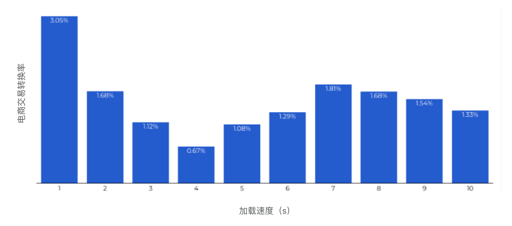
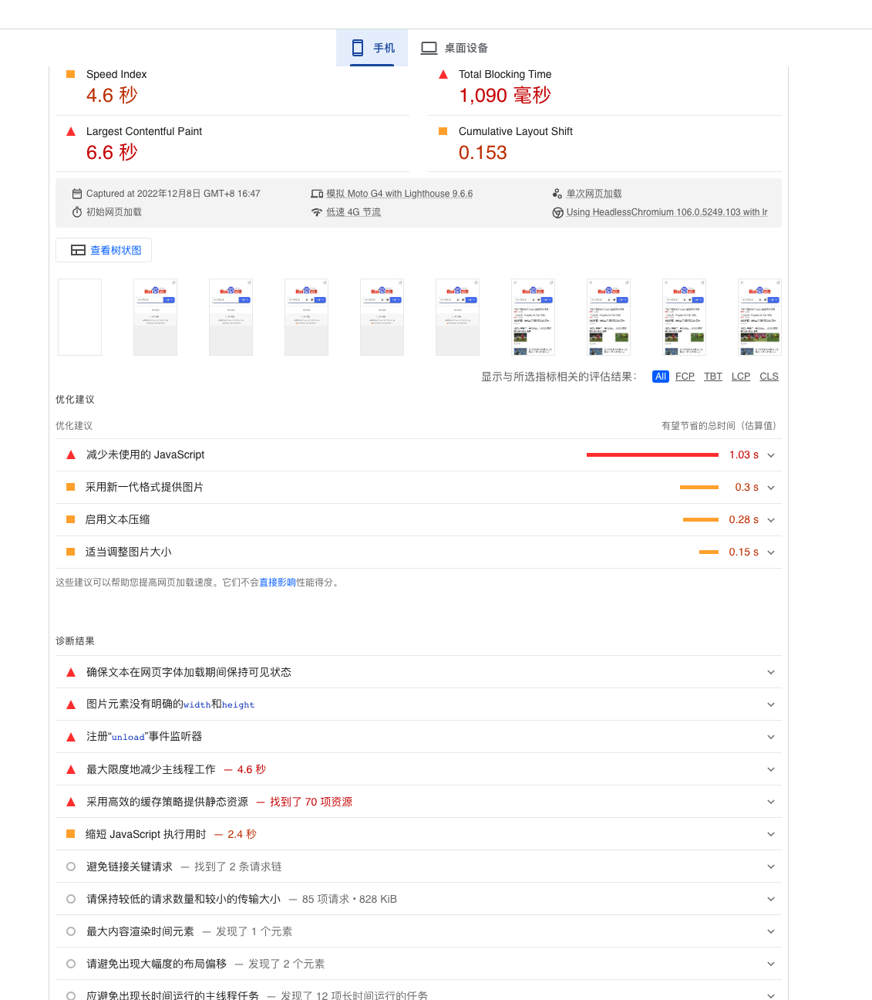

# 前言

众所周知，网站的加载速度直接影响了用户的浏览体验。但，具体什么表现才是真的慢​？

而较慢的网站是否真的会直接造成损失 ———— 答案是显而易见的，多项研究表明，网站的速度会直接影响转化率。

# 调研

我们对 来自20多个网站的转化率 和 超过27,000个网站首页的加载数据 进行了一些数据统计：

- 30天的网站快照
- 在30天内的560万次会话中，我们收集到了我们需要的页面加载速度样本量
- 其中6个网站是B2C电子商务，其他的大部分是B2B站点
- 这些网站包括来自各个国家不同类型，包含软件服务、旅游、电商等

## 调研结果

通过以上调研，基于我们关注的网站加载速度和转换率，我们得到以下数据：
- 超过82%的网站均能在5秒内快速响应，这与我们所知的研究是基本相同的
- 其中 加载速度流畅和加载速度一般的网站之间的转化率差异让我们感到震惊 ———— 在1秒内加载的站点的转化率比在5秒内加载的站点高3倍
- 而 加载速度流畅和加载速度缓慢的网站之间的转化率差异更加明显 ———— 在1秒内加载的站点的转化率比10秒内加载的站点高5倍

## 想提升转化率：应关注前1-4秒

与电商网站相比，其他相对简单的网站转化率会更高 ———— 电话、邮件联系方式等简单信息的交换障碍要低很多。

但是，尽管总体目标转换率高于交易率，但随着站点的变化，转化率的下降要陡峭得多。当页面加载1秒时，平均转化率几乎为40％。在2秒的加载时间，转化率已经下降到34％。在3秒钟时，转换率开始跌至29％，并在6秒的负载时间达到最低水平。

显而易见，加载速度超过5秒以上的站点，连一半的转化率都谈不上。🌚

## 改善交易指数：应关注前1-2秒

是不是听起来就很快？ 当用户习惯于在响应快速的网站平台上浏览购物时，他们中的大多数用户会直接舍弃在其他加载缓慢平台上的账户， 这对这些网站来说无疑是很大的损失。

电子商务转化率最高的加载速度是在1-2秒之间，超多1秒的转化率为3.05%， 在4秒的加载时间更是直接下降到了0.67%， 而之后更长时间的平台均低于 2%

事实上，当你的平台加载速度每增加1秒，电商转化率就会下降0.3%

我们来直接做个简单的数学计算吧：

我们假设有100个人在你的网站上购买价值 50 的产品， 以下数据就可以直接体现出差异：

|加载时间(s)|转化率(%)|收入|
|----------|--------|----|
|1      |3.05 | 1,525 |
|2      |1.68 | 840 |
|3      |1.12 | 560 |
|4      |2.93 | 335 |

在短短4秒的时间差距内，潜在的销售额下降了仅超过 1,190

如果我们以更多的用户、更高的消费来计算，则会导致潜在收入的巨大差距。

## 哪些页面更重要？

那首页、登陆、结算等页面真的比其他页面来得更加重要么？显而易见，以电商为主的平台，产品加载页面的速度对转化率的影响是最大的 ———— 所以，用户流量更多的页面是十分重要的，我们需要关注这部分的加载性能。

# 如何提升网站的加载速度？需要考虑哪些因素？

页面“重量”（这里我们以重量来类比站点资源的所有内容）不再是站点加载时间的最大因素 ———— 这是为什么？许多网站可以通过压缩的形式来减小“重量”（比如Gzip）。因此，在大多数情况下，更大的因素是服务器和站点配置。

如果你想提升网站平台的加载速度，可以从以下几方面着手：

## 网站Javascript脚本

在某些情况下，你可以将JavaScript脚本放置在网页页面底部，延迟加载或者通过添加 Async 属性来异步加载 ———— 如果你没有这么做，JavaScript脚本完全加载之前将导致你的页面呈现延迟，这意味着你的页面不会马上在用户面前呈现，这将导致某些用户会直接关闭该站点。

如果你需要页面加载后再触发JavaScript脚本，请使用延迟执行。
如果你不关注执行时机，采用异步执行方案即可。

在某些的场景中，SEO专家会建议在“DOM ready”或“Window Loaded”
之后再对一些DOM标签添加特殊属性，以此来提升页面的加载速度。

## Expires 和 ETags

在Headers响应头中的 ETags 和 Expires 也会影响页面的加载速度。这听起来可能很复杂，但它们都是很容易配置的 ———— IT研发们应该知道怎么做🌚。

这两个设置有助于减少浏览器对服务器的请求数量。它们会告诉浏览器哪些文件资源需要被更新。如果正确设置，则可以防止浏览器重新加载很少更改的资源（比如站点的Logo👨🏻‍💻）。 以上操作对非初次访问的访客十分有用， 当他们再次访问站点的时候无需全部重新加载网站。

### Expires

Expires HTTP Header 标记了响应内容的过期时间。如果Response响应内容中存在带有`max-age`和`s-maxage`的`Cache-Control`，则 `Expires` 会被忽略

### ETag
在HTTP1.1规范中，新增了一个HTTP头信息：ETag。对于普通开发者来说，可能平时真的不会接触到该HTTP头。平时接触不到或者说用得少，不代表这个请求头不重要。ETag使用得当，是可以减少服务器带宽压力的。

Etag是 Entity tag的缩写，可以理解为“被请求变量的实体值”，Etag是服务端的一个资源的标识，在 HTTP 响应头中将其传送到客户端。所谓的服务端资源可以是一个Web页面，也可以是JSON或XML等。服务器单独负责判断记号是什么及其含义，并在HTTP响应头中将其传送到客户端。比如，浏览器第一次请求一个资源的时候，服务端给予返回，并且返回了ETag: "50b1c1d4f775c61:df3" 这样的字样给浏览器，当浏览器再次请求这个资源的时候，浏览器会将If-None-Match: W/"50b1c1d4f775c61:df3" 传输给服务端，服务端拿到该ETAG，对比资源是否发生变化，如果资源未发生改变，则返回304HTTP状态码，不返回具体的资源。

## 图片

页面“重量”可能并不是最重要的。但是图像大小是加载时间的主要阻力， 如果可以，尽可能地压缩它们。

通过在[Google PageSpeed Insights](https://developers.google.com/speed/pagespeed/insights/)加载你的网站，会得到一份性能报告，报告中有一个部分提供了 适当尺寸，懒加载，编码图像和推荐图像格式的反馈内容。

## 其他

其他的优化手段会更复杂，但并不多。例如，任何有能力的Web开发人员或IT专业人员都可以通过GZIP压缩设置，或对慢速数据库加载时间进行故障排除等。

# 小细节造就大优势

其他网络速度工具：

<a href="https://developers.google.com/speed/pagespeed/insights/" target="_blank" rel="noopener noreferrer">PageSpeed Insights</a>  <a href="https://cloud.google.com/bigquery/" target="_blank" rel="noopener noreferrer">BigQuery</a>  <a href="https://developers.google.com/web/tools/chrome-user-experience-report/" target="_blank" rel="noopener noreferrer">Chrome User Experience Report</a>  <a href="https://web.dev/measure" target="_blank" rel="noopener noreferrer">Measure</a>

与其他数字营销挑战相比，页面速度易于解决。它具有可测量的结果。但是很少有公司做这类简单的事情使网站性能更佳（只做这类基础简单的优化，就可以获得巨大的竞争优势）

# 最后

如果您准备解决网站速度，我们会为您提供服务。

